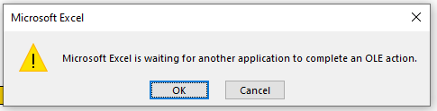

# How to manage devices linked to your license

You can view and manage the devices linked to your license from the **Device Manager**.

1. Go to the [Device Manager](https://pythonandvba.com/go/device-manager).\
   
2. Log in with your license key and product.
3. You will see how many devices are currently registered.
4. To remove a device, click **Remove** next to it.\
   .png>)
5. It can take **up to 2 minutes for the update to apply**. After that, click **Refresh** and you should see the changes.


NOTE: Please be patient after removing a device. The update may take up to **2 minutes**. Once that time has passed, click **Refresh** to see the device slot freed.

