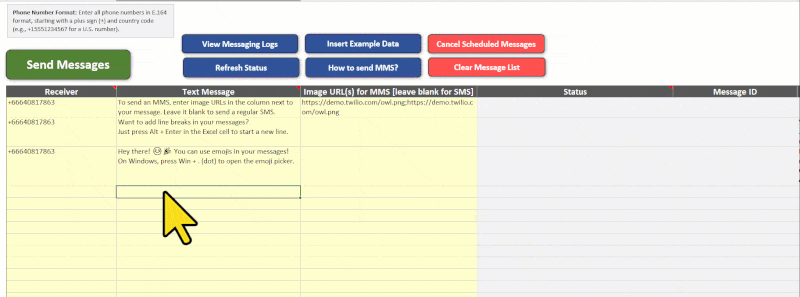

# What does the message status mean?

The **Status** column in Twilio Blaster provides updates on your messages. After sending, you can check the latest status by clicking **Refresh Status**. Initially, messages are marked as **Queued**, meaning they have been successfully sent to Twilio for processing. Twilio then updates the status accordingly.

<figure><figcaption></figcaption></figure>

Here are some common statuses you may see:

<table data-header-hidden><thead><tr><th width="255"></th><th></th></tr></thead><tbody><tr><td>Status</td><td>Description</td></tr><tr><td><strong>Queued</strong></td><td>The message has been sent to Twilio and is waiting to be processed.</td></tr><tr><td><strong>Scheduled</strong></td><td>The message is set to be sent at a future time.</td></tr><tr><td><strong>Sending</strong></td><td>The message is currently in the process of being sent.</td></tr><tr><td><strong>Sent</strong></td><td>The message has been sent, but delivery confirmation is not yet available.</td></tr><tr><td><strong>Delivered</strong></td><td>The message was successfully delivered to the recipient.</td></tr><tr><td><strong>Read</strong> (WhatsApp only)</td><td>The recipient has read the message.</td></tr><tr><td><strong>Undelivered</strong></td><td>The message was not delivered, possibly due to an issue like a blocked number or unavailable device.</td></tr><tr><td><strong>Failed</strong></td><td>The message could not be sent, often due to account restrictions.</td></tr></tbody></table>

To get the most recent status updates, simply click **Refresh Status**. If you need detailed logs or tracking, you can view them in Twilio's official [Messaging Logs](https://pythonandvba.com/go/twilio-blaster-messaging-logs).
